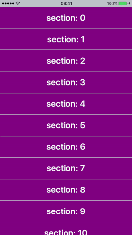

[](https://travis-ci.org/touchlane/CampcotCollectionView)
[](https://codecov.io/gh/touchlane/CampcotCollectionView)
[](http://cocoapods.org/pods/CampcotCollectionView)
[](http://cocoapods.org/pods/CampcotCollectionView)
[](http://cocoapods.org/pods/CampcotCollectionView)

This library provides a custom `UICollectionView` that allows to expand and collapse sections. Provides a simple API to manage collection view appearance.



# Requirements

* iOS 9.0+
* Xcode 10.2+
* Swift 5.0+

# Installation

## CocoaPods

[CocoaPods](https://cocoapods.org) is a dependency manager for Cocoa projects. You can install it with the following command:

```$ gem install cocoapods```

To integrate CampcotCollectionView into your Xcode project using CocoaPods, specify it in your ```Podfile```:

```ruby
source 'https://github.com/CocoaPods/Specs.git'
platform :ios, '9.0'
use_frameworks!

target '<Your Target Name>' do
    pod 'CampcotCollectionView'
end
```

Then, run the following command:

```$ pod install```

# Usage

### Manual Setup

```swift
import CampcotCollectionView
```

1. Create CollectionView
```swift
let campcotCollectionView = CampcotCollectionView()
```
2. Add `campcotCollectionView` to view hierarchy.
3. Call `toggle` method on `campcotCollectionView`.
```swift
public func toggle(to section: Int,
                   offsetCorrection: CGFloat = default,
                   animated: Bool,
                   completion: ((Bool) -> Void)? = default)
```
### Storyboard Setup

1. Add UICollectionView to your Storyboard.
2. In `Identity Inspector` set the `Class` property to `CampcotCollectionView`.
3. Open `Attributes Inspector` and set the `Layout` property to `Custom`. Set `Class` property to either `ExpandedLayout` or `CollapsedLayout`.
4. Create outlet for your collectionView.
5. Set datasource and delegate for collectionView.
5. Set the settings for collectionView in  `Attributes Inspector` or manualy.

# Documentation

### CampcotCollectionView

A Boolean value that determines whether the sections are expanded.
```swift
public var isExpanded: Bool { get }
```

Expands all the sections. Pins a section at index `section` to the top of view bounds.
`offsetCorrection` - the offset for pinned section from the top. Default value of `offsetCorrection` is `0`.
`animated` - if `true` expands sections with animation.
`completion` - callback for animation.
```swift
public func expand(from section: Int,
                   offsetCorrection: CGFloat = default,
                   animated: Bool,
                   completion: ((Bool) -> Void)? = default)
```

Collapses all the sections. Pins a section at index `section` to the top of view bounds.
`offsetCorrection` - the offset for pinned section from the top. Default value of `offsetCorrection` is `0`.
`animated` - if `true` collapses sections with animation.
`completion` - callback for animation.
```swift
public func collapse(to section: Int,
                     offsetCorrection: CGFloat = default,
                     animated: Bool,
                     completion: ((Bool) -> Void)? = default)
```

Toggles current state from collapsed to expaned and vise versa. Pins a section at index `section` to the top of view bounds.
`offsetCorrection` - the offset for pinned section from the top. Default value of `offsetCorrection` is `0`.
`animated` - if `true` toggles sections with animation.
`completion` - callback for animation.
```swift
public func toggle(to section: Int,
                   offsetCorrection: CGFloat = default,
                   animated: Bool,
                   completion: ((Bool) -> Void)? = default)
```
___
